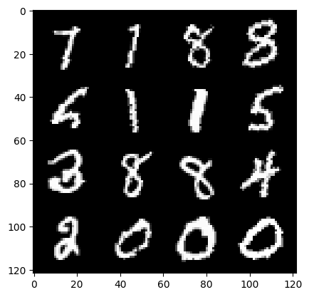
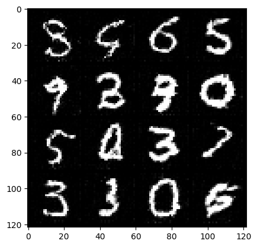

# Fake Image Generation with Generative Adversarial Networks (GAN)

## Overview

This project demonstrates the use of Generative Adversarial Networks (GANs) to generate fake images for the MNIST dataset. GANs consist of a generator and a discriminator, which are trained simultaneously through adversarial training. The generator tries to create realistic images, while the discriminator tries to distinguish between real and fake images. You can use the same idea for othe datasets.

| Real | Fake |
|----------|----------|
| Real images from MNIST dataset | Fake Images Genereted with the trained GAN |
|||

## Usage

You can work with this repository in two ways:

1. Clone the repository and run the notebook

2. Open the note book in Colab:
https://colab.research.google.com/github/barzansaeedpour/GAN-Fake-Image-Generation/blob/main/GAN-Fake-Image-Generation.ipynb

## Project Structure

- `GAN-Fake-Image-Generation.ipynb`: Script for training the GAN on the MNIST dataset.

## License

This project is licensed under the MIT License - see the [LICENSE](LICENSE) file for details.

Feel free to contribute to the project by opening issues or submitting pull requests!